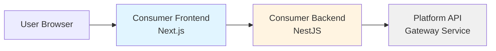
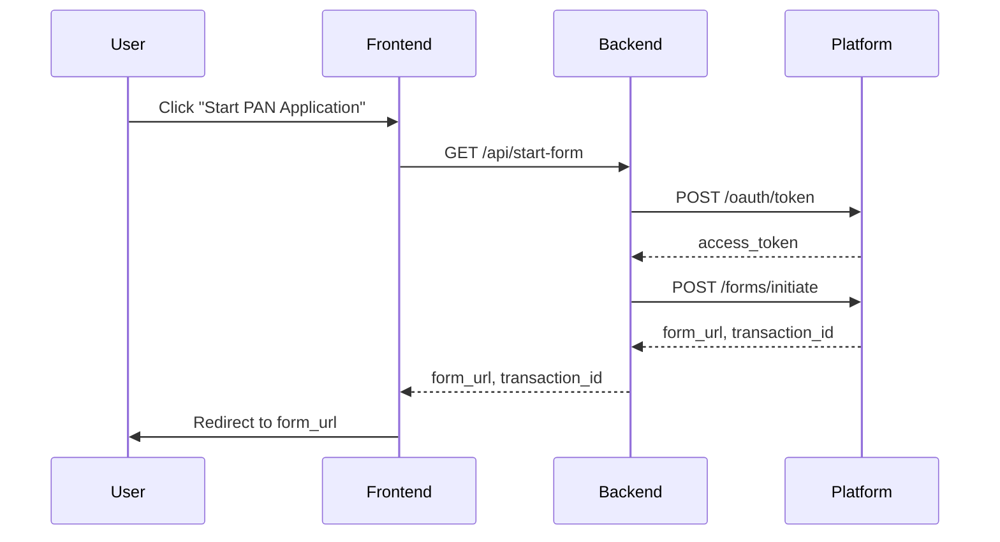
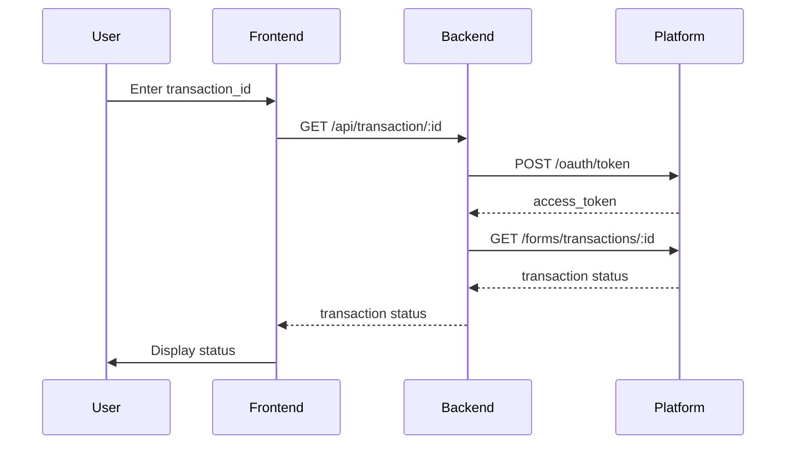

# Design Document: API Gateway Consumer Test App

## Overview

This design document specifies the architecture and implementation details for a minimal consumer test application that demonstrates integration with an API gateway form service. The system consists of two applications:

1. **Consumer Backend** (NestJS): Handles OAuth2 authentication and proxies API calls to the Platform
2. **Consumer Frontend** (Next.js 16+ App Router): Provides a simple web interface for form initiation and status checking

The application demonstrates the complete flow: OAuth2 authentication → form initiation → user form completion → transaction status query. This is designed for R&D testing purposes only, intentionally excluding production features like token caching, rate limiting, complex error handling, and monitoring.

## Architecture

### System Components



### Component Responsibilities

**Consumer Frontend (Next.js 16+ App Router)**
- Renders UI for form initiation and status checking
- Makes HTTP requests to Consumer Backend using native Fetch API
- Handles browser redirects to Platform form URLs
- Displays status information and error messages
- Uses Tailwind CSS for styling
- Leverages App Router architecture with Server and Client Components

**Consumer Backend (NestJS)**
- Authenticates with Platform using OAuth2 client credentials
- Proxies form initiation requests to Platform
- Proxies transaction status queries to Platform
- Manages environment configuration

**Platform API**
- Issues OAuth2 access tokens
- Creates form sessions and returns form URLs
- Provides transaction status information

### Data Flow

#### Flow 1: Form Initiation



#### Flow 2: Transaction Status Query



## Components and Interfaces

### Consumer Backend Components

#### AuthService (src/auth/auth.service.ts)

Handles OAuth2 authentication with the Platform.

```typescript
interface AuthService {
  getAccessToken(): Promise<string>;
}
```

**Methods:**
- `getAccessToken()`: Obtains an access token from the Platform OAuth endpoint using client credentials grant type

**Dependencies:**
- HttpService (from @nestjs/axios)
- ConfigService (for CLIENT_ID, CLIENT_SECRET, PLATFORM_BASE_URL)

#### FormService (src/form/form.service.ts)

Handles form initiation and transaction status queries.

```typescript
interface FormInitiationResponse {
  form_url: string;
  transaction_id: string;
}

interface TransactionStatus {
  transaction_id: string;
  status: string;
  [key: string]: any;
}

interface FormService {
  initiateForm(): Promise<FormInitiationResponse>;
  getTransactionStatus(transactionId: string): Promise<TransactionStatus>;
}
```

**Methods:**
- `initiateForm()`: Calls Platform form initiation endpoint with access token
- `getTransactionStatus(transactionId)`: Queries Platform for transaction status

**Dependencies:**
- AuthService (for access tokens)
- HttpService (for Platform API calls)
- ConfigService (for PLATFORM_BASE_URL)

#### AppController (src/app.controller.ts)

Exposes HTTP endpoints for the frontend.

```typescript
interface AppController {
  startForm(): Promise<FormInitiationResponse>;
  getTransactionStatus(id: string): Promise<TransactionStatus>;
}
```

**Endpoints:**
- `GET /api/start-form`: Initiates a form session
- `GET /api/transaction/:id`: Retrieves transaction status

**Dependencies:**
- FormService

### Consumer Frontend Components

#### Home Page (app/page.tsx)

Root page with form initiation button (Server Component with Client Component for interactivity).

**UI Elements:**
- Page title
- "Start PAN Application" button
- Error message display area

**Behavior:**
- On button click: calls API service to start form
- On success: redirects browser to form_url
- On error: displays error message

**Styling:**
- Uses Tailwind CSS utility classes for layout and styling

#### Status Page (app/status/page.tsx)

Transaction status checking page (Server Component with Client Component for interactivity).

**UI Elements:**
- Page title
- Transaction ID input field
- Submit button
- Status display area
- Error message display area

**Behavior:**
- On submit: calls API service with transaction_id
- On success: displays transaction status
- On error: displays error message

**Styling:**
- Uses Tailwind CSS utility classes for layout and styling

#### Root Layout (app/layout.tsx)

Root layout component that wraps all pages.

**Responsibilities:**
- Defines HTML structure
- Imports global styles and Tailwind CSS
- Provides consistent layout across pages

#### API Service (lib/api.ts)

Handles HTTP communication with Consumer Backend.

```typescript
interface ApiService {
  startForm(): Promise<FormInitiationResponse>;
  getTransactionStatus(transactionId: string): Promise<TransactionStatus>;
}
```

**Methods:**
- `startForm()`: Calls GET /api/start-form
- `getTransactionStatus(transactionId)`: Calls GET /api/transaction/:id

**Dependencies:**
- Fetch API (native)

## Data Models

### OAuth Token Request

```typescript
interface OAuthTokenRequest {
  client_id: string;
  client_secret: string;
  grant_type: 'client_credentials';
}
```

### OAuth Token Response

```typescript
interface OAuthTokenResponse {
  access_token: string;
  token_type: 'Bearer';
  expires_in: number;
}
```

### Form Initiation Request

```typescript
interface FormInitiationRequest {
  form_id: string;
  user_reference: string;
}
```

### Form Initiation Response

```typescript
interface FormInitiationResponse {
  form_url: string;
  transaction_id: string;
}
```

### Transaction Status Response

```typescript
interface TransactionStatus {
  transaction_id: string;
  status: string;
  // Additional fields returned by Platform
  [key: string]: any;
}
```

## Technology Stack

### Consumer Backend
- **Framework**: NestJS 10.x
- **Runtime**: Node.js 18.x or higher
- **HTTP Client**: @nestjs/axios (Axios wrapper)
- **Configuration**: @nestjs/config
- **Language**: TypeScript 5.x

### Consumer Frontend
- **Framework**: Next.js 16.x (App Router)
- **Runtime**: Node.js 18.x or higher
- **HTTP Client**: Fetch API (native)
- **Language**: TypeScript 5.x
- **Styling**: Tailwind CSS 4.x

### Development Tools
- **Package Manager**: npm or yarn
- **Environment Variables**: .env files

## Project Structure

### Consumer Backend Structure

```
consumer-backend/
├── src/
│   ├── auth/
│   │   ├── auth.service.ts
│   │   └── auth.module.ts
│   ├── form/
│   │   ├── form.service.ts
│   │   └── form.module.ts
│   ├── app.controller.ts
│   ├── app.module.ts
│   └── main.ts
├── .env
├── .env.example
├── package.json
├── tsconfig.json
└── nest-cli.json
```

### Consumer Frontend Structure

```
consumer-frontend/
├── app/
│   ├── page.tsx
│   ├── status/
│   │   └── page.tsx
│   ├── layout.tsx
│   └── globals.css
├── lib/
│   └── api.ts
├── components/
│   ├── FormInitiator.tsx
│   └── StatusChecker.tsx
├── .env.local
├── .env.example
├── package.json
├── tsconfig.json
├── tailwind.config.ts
├── postcss.config.js
└── next.config.js
```

## Configuration

### Backend Environment Variables

```
PLATFORM_BASE_URL=https://api.platform.example.com
CLIENT_ID=consumer_client_id
CLIENT_SECRET=consumer_client_secret
PORT=3001
```

### Frontend Environment Variables

```
NEXT_PUBLIC_BACKEND_URL=http://localhost:3001
```

### API Endpoints

**Platform API Endpoints:**
- OAuth Token: `POST ${PLATFORM_BASE_URL}/oauth/token`
- Form Initiation: `POST ${PLATFORM_BASE_URL}/forms/initiate`
- Transaction Status: `GET ${PLATFORM_BASE_URL}/forms/transactions/:id`

**Consumer Backend Endpoints:**
- Form Initiation: `GET http://localhost:3001/api/start-form`
- Transaction Status: `GET http://localhost:3001/api/transaction/:id`


## Correctness Properties

*A property is a characteristic or behavior that should hold true across all valid executions of a system—essentially, a formal statement about what the system should do. Properties serve as the bridge between human-readable specifications and machine-verifiable correctness guarantees.*

### Property 1: OAuth Request Format

*For any* OAuth token request to the Platform, the request body SHALL contain client_id, client_secret, and grant_type='client_credentials' parameters.

**Validates: Requirements 1.2**

### Property 2: Access Token Extraction

*For any* successful OAuth response from the Platform, the Consumer_Backend SHALL correctly extract the access_token field from the response body.

**Validates: Requirements 1.3**

### Property 3: Bearer Token Usage

*For any* authenticated Platform API request, the Consumer_Backend SHALL include the access_token in the Authorization header with the format "Bearer {access_token}".

**Validates: Requirements 1.4**

### Property 4: Authentication Before Platform Calls

*For any* Platform API call (form initiation or transaction status query), the Consumer_Backend SHALL first obtain an access_token from the OAuth endpoint before making the API request.

**Validates: Requirements 2.2, 3.2**

### Property 5: Form Initiation Request Format

*For any* form initiation request to the Platform, the request body SHALL contain form_id and user_reference fields.

**Validates: Requirements 2.3**

### Property 6: Response Proxying

*For any* successful Platform API response (form initiation or transaction status), the Consumer_Backend SHALL forward the response data to the caller without modification.

**Validates: Requirements 2.4, 3.4**

### Property 7: Backend Error Handling

*For any* error response from the Platform (OAuth, form initiation, or transaction status), the Consumer_Backend SHALL return an HTTP error response to the caller.

**Validates: Requirements 2.5, 3.5**

### Property 8: Transaction Status Request Format

*For any* transaction status query, the Consumer_Backend SHALL construct the Platform API URL as /forms/transactions/{transaction_id} where transaction_id is the provided identifier.

**Validates: Requirements 3.3**

### Property 9: URL Construction

*For any* Platform API endpoint path, the Consumer_Backend SHALL construct the full URL by concatenating PLATFORM_BASE_URL with the endpoint path.

**Validates: Requirements 4.4**

### Property 10: Form Initiation API Call

*For any* "Start PAN Application" button click, the Consumer_Frontend SHALL make a GET request to /api/start-form on the Consumer_Backend.

**Validates: Requirements 5.3**

### Property 11: Form URL Redirect

*For any* successful form initiation response containing a form_url, the Consumer_Frontend SHALL redirect the browser to that form_url.

**Validates: Requirements 5.4**

### Property 12: Transaction Status API Call

*For any* transaction_id submission on the status page, the Consumer_Frontend SHALL make a GET request to /api/transaction/{transaction_id} on the Consumer_Backend.

**Validates: Requirements 6.4**

### Property 13: Status Display

*For any* successful transaction status response, the Consumer_Frontend SHALL display the status information to the user.

**Validates: Requirements 6.5**

### Property 14: Frontend Error Display

*For any* error response from the Consumer_Backend (form initiation or transaction status), the Consumer_Frontend SHALL display an error message to the user.

**Validates: Requirements 5.5, 6.6**

## Error Handling

The application implements minimal error handling suitable for R&D testing:

### Backend Error Handling

**OAuth Errors:**
- Network failures: Return 500 Internal Server Error
- Invalid credentials: Return 401 Unauthorized
- Malformed responses: Return 500 Internal Server Error

**Platform API Errors:**
- Network failures: Return 500 Internal Server Error
- 4xx errors from Platform: Forward the status code to the caller
- 5xx errors from Platform: Return 502 Bad Gateway
- Malformed responses: Return 500 Internal Server Error

**Implementation Approach:**
- Use try-catch blocks around HTTP calls
- Return appropriate HTTP status codes
- Include minimal error messages in response body
- No retry logic or circuit breakers
- No detailed error logging

### Frontend Error Handling

**API Call Errors:**
- Network failures: Display "Unable to connect to server"
- 4xx/5xx responses: Display "An error occurred. Please try again."
- No error details exposed to user
- No retry mechanisms

**Implementation Approach:**
- Use try-catch blocks around API calls
- Display simple error messages in the UI
- No error tracking or reporting
- No validation beyond required fields

## Testing Strategy

### Dual Testing Approach

The application requires both unit tests and property-based tests for comprehensive coverage:

- **Unit tests**: Verify specific examples, edge cases, and error conditions
- **Property tests**: Verify universal properties across all inputs

Both testing approaches are complementary and necessary. Unit tests catch concrete bugs in specific scenarios, while property tests verify general correctness across a wide range of inputs.

### Unit Testing

**Backend Unit Tests:**
- Test AuthService with mocked HTTP responses
- Test FormService with mocked AuthService and HTTP responses
- Test AppController with mocked FormService
- Test error handling with various error scenarios
- Test configuration loading with different environment variables

**Frontend Unit Tests:**
- Test API service with mocked Fetch responses
- Test Client Components with mocked API service
- Test button click handlers
- Test form submission handlers
- Test error message display
- Test Server Component rendering

**Testing Tools:**
- Backend: Jest with NestJS testing utilities
- Frontend: Jest with React Testing Library and Next.js testing utilities

### Property-Based Testing

**Property Testing Library:**
- Backend: fast-check (TypeScript property-based testing library)
- Frontend: fast-check with React Testing Library

**Configuration:**
- Minimum 100 iterations per property test
- Each test tagged with comment referencing design property
- Tag format: `// Feature: api-gateway-consumer-test-app, Property {number}: {property_text}`

**Backend Property Tests:**

1. **OAuth Request Format** (Property 1)
   - Generate random client credentials
   - Verify request body structure

2. **Access Token Extraction** (Property 2)
   - Generate random OAuth responses
   - Verify token extraction

3. **Bearer Token Usage** (Property 3)
   - Generate random access tokens
   - Verify Authorization header format

4. **Authentication Before Platform Calls** (Property 4)
   - Generate random API call scenarios
   - Verify OAuth call occurs first

5. **Form Initiation Request Format** (Property 5)
   - Generate random form_id and user_reference values
   - Verify request body structure

6. **Response Proxying** (Property 6)
   - Generate random Platform responses
   - Verify responses are forwarded unchanged

7. **Backend Error Handling** (Property 7)
   - Generate random error responses
   - Verify error responses are returned

8. **Transaction Status Request Format** (Property 8)
   - Generate random transaction IDs
   - Verify URL construction

9. **URL Construction** (Property 9)
   - Generate random base URLs and endpoint paths
   - Verify concatenation logic

**Frontend Property Tests:**

10. **Form Initiation API Call** (Property 10)
    - Generate random button click events
    - Verify API call is made

11. **Form URL Redirect** (Property 11)
    - Generate random form URLs
    - Verify redirect occurs

12. **Transaction Status API Call** (Property 12)
    - Generate random transaction IDs
    - Verify API call with correct ID

13. **Status Display** (Property 13)
    - Generate random status responses
    - Verify display in UI

14. **Frontend Error Display** (Property 14)
    - Generate random error responses
    - Verify error message display

### Test Coverage Goals

- Backend: 80%+ code coverage
- Frontend: 70%+ code coverage
- All correctness properties implemented as property tests
- All error paths covered by unit tests
- All UI interactions covered by unit tests

### Testing Exclusions

The following are intentionally NOT tested (minimal R&D implementation):
- Performance and load testing
- Security testing (authentication security, XSS, CSRF)
- Browser compatibility testing
- Accessibility testing
- Integration testing with real Platform API
- End-to-end testing with real browser automation
